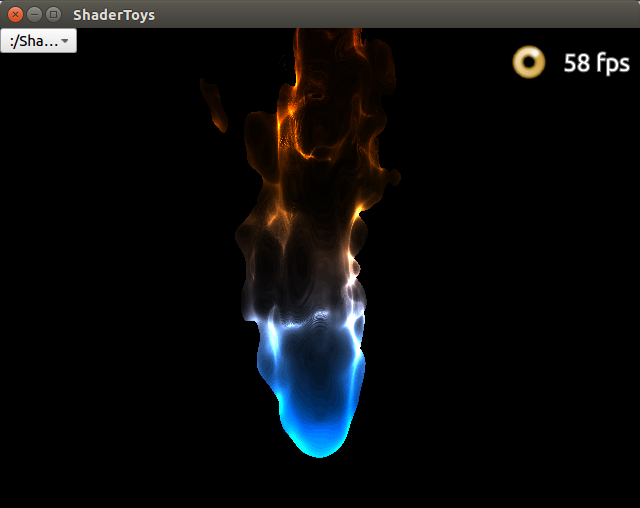

# ShaderToy Qml Demo
参考网站 https://www.shadertoy.com

## 示例图片




## 说明

我做了一个Shader搜索器，会自动搜索指定路径下所有子目录，找到扩展名为glsl的文件并添加到程序的Shader列表中。</br>
所以只要写一个符合ShaderToy格式的shader，放在指定路径下，然后启动程序，在Comboox中选择一下，就可以方便地切换到对应的Shader。</br>
ShaderToy支持四个纹理通道，命名为iChannel0..3, 如果要添加纹理，只需要将png格式的纹理图片(使用其它QImage支持的格式，需要修改qml中相应的代码)，</br>命名为"iChannel0.png"或者"iChannel1.png"等，放在glsl文件相同路径下，软件就会自动加载该纹理。


## 关于ShadeToy

所有的Shader都有一个统一的输入
```
//uniform vec3      iResolution;           // viewport resolution (in pixels)
//uniform float     iGlobalTime;           // shader playback time (in seconds)
//uniform float     iChannelTime[4];       // channel playback time (in seconds)
//uniform vec3      iChannelResolution[4]; // channel resolution (in pixels)
//uniform vec4      iMouse;                // mouse pixel coords. xy: current (if MLB down), zw: click
//uniform samplerXX iChannel0..3;          // input channel. XX = 2D/Cube
//uniform vec4      iDate;                 // (year, month, day, time in seconds)
//uniform float     iSampleRate;           // sound sample rate (i.e., 44100)
```

所有的Shader都有统一的入口
```
void mainImage(out vec4 fragColor, in vec2 fragCoord)
{
    ...
}
```
## qml对shaderoy的封装：

qml 提供了Shaderffect，可以直接使用Shader代码。
使用Shaderffect对Shadertoy的封装如下：

```
ShaderEffect {
    id: shader
    readonly property vector3d  iResolution: Qt.vector3d(shader.width, shader.height, 0.0)
    property int        iFrame: 10
    property real       iGlobalTime: 0
    property var        iChannelTime: [0, 1, 2, 3]
    property var        iChannelResolution: [Qt.vector3d(shader.width, shader.height, 0.0)]
    property vector4d   iMouse;
    property var        iChannel0;
    property var        iChannel1;
    property var        iChannel2;
    property var        iChannel3;
    property vector4d   iDate;
    property real       iSampleRate: 44100
    property real       iTimeDelta: 100
    property alias hoverEnabled: mouse.hoverEnabled
    ...
}
```

iChannel 纹理通道，使用方式是通过ShaderEffectSource

```
iChannel0: ShaderEffectSource{
            hideSource: true
            textureMirroring: ShaderEffectSource.NoMirroring
            sourceItem: Image {
                source: ""               
            }
}
```

注意ShaderEffectSource，有个属性是textureMirroring,用来描述纹理翻转变换的。默认值是上下翻转。
我在Qt5.8中把这个属性设置为不翻转就可以正常显示了，但是在Qt5.6的版本中，QtQuick 2.5 提示没有textureMirroring这个属性

## LinkList

https://shadertoy.com/view/MdX3zr

https://shadertoy.com/view/Ms2SD1

https://shadertoy.com/view/Xds3zN

https://shadertoy.com/view/XsXXDn

